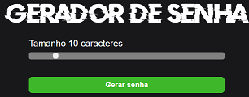
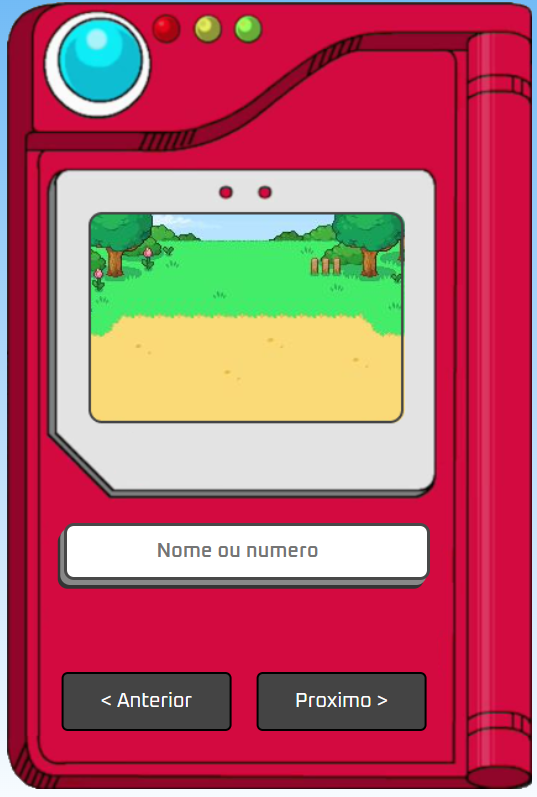

# Pokedex

Um projeto afins de demonstrar um pouco do conhecimento que vim desenvolvendo com meus estudos na area de programação!

fonte do projeto: https://github.com/manualdodev/pokedex

### Olá! Eu sou o Matheus Silva. ✌️ 

 

  

## Tecnologias do meu dia a dia

 
    
    
    
    
    
    
    

 

Formado em rede de computadores e apaixonado por programação! Atualmente estudando com foco em Front-end, mas também fascinado com o Back-end.

# projetos

 
 
Site para criação de senhas seguras baseado no padrão alfanumérico.

 

 
Projeto de Pokedex afim de fazer uso do meu conhecimento voltado a JavaScript e um pouco sobre API.

## Contato

 matheusescola.081@gmail.com / matheus.silva081@icloud.com
